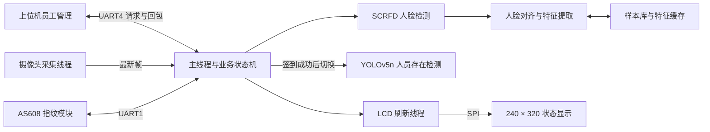

# 👤 FCDC RECG v2 · RV1106 人脸指纹考勤与在岗检测


基于 **Luckfox Pico Pro Max（RV1106）** 的端侧人员管理程序，将人脸识别、AS608 指纹认证、YOLOv5n 人员存在检测与 SPI LCD 状态显示集成在同一终端。上位机通过 UART 发起员工录入、签到、签退和删除请求，板端完成身份识别与结果回传。

本仓库对应“芯智检”系统的 **RV1106 人员管理子系统**；芯片质检、机械臂分拣和 RK3588 疲劳检测属于其他模块。

## 📑 文档导航

- [项目架构](#-项目架构)
- [核心功能](#-核心功能)
- [硬件与开发环境](#-硬件与开发环境)
- [编译与部署](#-编译与部署)
- [员工管理协议](#-员工管理协议)
- [性能与调度策略](#-性能与调度策略)
- [验证与当前边界](#-验证与当前边界)
- [目录结构](#-目录结构)
- [相关文档](#-相关文档)

## 🏗️ 项目架构



业务主线：**录入员工 → 发起签到 → 人脸或指纹认证 → 在岗检测 → 发起签退 → 身份核验与结果回传**。

摄像头与 LCD 传输独立于主线程；人脸识别和在岗检测按业务阶段切换。系统面向单工位，维护一名当前签到员工。

## ✨ 核心功能

### 人脸检测与身份识别

- SCRFD 检测人脸和五个关键点，检测输入为 `640 × 640`。
- 人脸对齐后送入 `112 × 112` 特征模型，输出 512 维归一化特征；代码兼容命名为 MobileFace/ArcFace 的识别模块，实际权重为 `facerecg.rknn`。
- 同一员工保留多条样本特征，匹配时取该员工样本中的最小欧氏距离。
- 同时检查最佳距离和不同员工候选之间的距离差，减少模糊匹配。
- 检查人脸尺寸、关键点几何关系和清晰度；采用连续有效识别确认，并对同一身份的短窗口特征进行均值融合。

### 员工录入与删除

- 上位机传入姓名与工号，在线采集目标为两张人脸样本，并完成指纹模板录入。
- 保存人脸图片、特征缓存和工号到指纹模板页号的映射，支持重新启动后加载。
- 拒绝重复工号，录入失败分支包含相应资源清理与回包。
- 删除时先处理指纹模板，再更新人脸记录和指纹映射；各阶段失败有明确日志。

### 人脸或指纹考勤

- 签到由上位机请求启用，人脸与指纹是 **任选一种** 的认证方式，并非必须同时通过。
- 签到成功后结束认证会话，进入在岗检测；已有在岗员工时拒绝再次签到。
- 签退识别的工号需要与当前签到员工一致。
- 通过协议回传工号、时间戳及相关结果；当前不由 `AttendanceService` 写本地 CSV 考勤表。

### 人员在岗检测

- 使用 YOLOv5n 的 `person` 检测结果，结合置信度和框面积比例判断画面中是否有人。
- 显示当前状态并在内存中累计在岗时间与会话总时长。
- 这是人员存在检测，不等同于持续确认签到本人身份，也不包含疲劳识别。

### LCD 与外设交互

- 2.8 寸 SPI LCD 显示人脸框、身份、业务提示及帧率信息。
- 指纹录入、识别、删除与清空接口封装在 `AS608` 模块中。
- 提供云台跟踪相关模块及独立 PWM 调试源码，接线和 PWM 配置需与实际硬件对应。

## 🛠️ 硬件与开发环境

| 项目 | 当前配置 |
|---|---|
| 目标板 | Luckfox Pico Pro Max / RV1106 |
| 构建环境 | Linux 或 WSL2，CMake 3.10+，Luckfox Pico SDK |
| 默认工具链 | `arm-rockchip830-linux-uclibcgnueabihf` |
| 图像与推理 | OpenCV 4、RKNN Runtime |
| 摄像头 | 通过 OpenCV 打开设备 0，请求采集尺寸 `640 × 480` |
| LCD | 240 × 320，SPI 接口 |
| 指纹模块 | AS608，默认 `/dev/ttyS1`，115200 波特率 |
| 员工管理串口 | 默认 `/dev/ttyS4` |
| 控制与调试串口 | 默认 `/dev/ttyS2` |

仓库包含构建所用的头文件、预编译库及模型。部署固件的 libc、RKNN Runtime 和驱动需要与所用库匹配；串口、SPI 和摄像头设备应已在板端配置可用。

## 🚀 编译与部署

### 1. 获取代码并配置 SDK

```bash
git clone https://github.com/guyuan21/FCDC_RECG_v.2.git
cd FCDC_RECG_v.2
export LUCKFOX_SDK_PATH=/path/to/luckfox-pico
bash build.sh
```

将 SDK 路径替换为本机实际位置。`build.sh` 默认选择 uClibc 和 Pro Max，会重新创建构建目录；安装输出在 `install/RV1106_demo/`。

日常增量构建：

```bash
cmake --build build -j
cmake --install build
```

### 2. 传输安装目录

```bash
scp -r install/RV1106_demo root@<板端IP>:/root/
```

安装目录包括主程序、三个模型与启动脚本。运行时依赖需由匹配的板端固件或 SDK 运行库提供；该安装步骤不代表已自动打包全部动态库。

### 3. 板端运行

```bash
cd /root/RV1106_demo
mkdir -p faces
chmod +x retinaface_facenet_spidev run_retinaface_facenet_spidev.sh
./run_retinaface_facenet_spidev.sh
```

也可直接指定模型和数据库目录：

```bash
./retinaface_facenet_spidev \
  ./model/facedet.rknn \
  ./model/facerecg.rknn \
  ./faces \
  ./model/yolov5n.rknn
```

启动后，通过上位机协议执行员工录入与考勤。仅站在摄像头前不会自动创建有效签到会话。

### 4. 常用运行配置

```bash
export ATTENDANCE_FINGERPRINT_DEV=/dev/ttyS1
export ATTENDANCE_FINGERPRINT_BAUD=115200
export ATTENDANCE_CONTROL_DEV=/dev/ttyS2
export ATTENDANCE_UART_UPLOAD_DEV=/dev/ttyS4
export ATTENDANCE_TIMEZONE=CST-8
export ATTENDANCE_LCD_SPI_MHZ=35
ATTENDANCE_PROTOCOL_LOG=1 ./run_retinaface_facenet_spidev.sh
```

串口和 SPI 参数请按实际板卡配置调整。更多变量及清库命令见 [命令说明](code/docs/COMMANDS.md)。清库会删除员工资料及指纹模板，仅应在确认需要重置时使用。

## 📡 员工管理协议

协议使用逐字节状态机解析，包含命令、序号、长度、CRC 和帧尾。

```text
AA 55 | CMD | SEQ | LEN | PAYLOAD | CRC_H CRC_L | FF
```

- `LEN` 占一个字节，负载最大 255 字节。
- 使用 CRC16/MODBUS 算法，覆盖 `CMD + SEQ + LEN + PAYLOAD`。
- 本项目在线路上先发送 CRC 高字节，再发送低字节；不要直接套用其他 Modbus 报文的字节序。
- 业务字段的具体编码以 [employee_protocol.h](code/include/employee_protocol.h) 和 [employee_protocol.cc](code/src/employee_protocol.cc) 为准。

| 请求 | 命令码 | 结果 |
|---|---|---|
| 员工录入 | `0x01` | `0x02` 录入结果 |
| 签到 | `0x10` | `0x11` 成功 / `0x12` 失败 |
| 签退 | `0x20` | `0x21` 签退结果 |
| 删除员工 | `0x30` | 由当前员工管理处理逻辑返回结果 |
| 通用错误 | — | `0xFF` 错误回包 |

签到/签退会话超时配置为 15 秒，录入会话为 30 秒。超时检查由主循环执行，阻塞式外设操作可能影响实际返回时刻。

## ⚡ 性能与调度策略

以下是 **源码默认配置，不是板端实测成绩**。

| 参数 | 默认值 | 含义 |
|---|---|---|
| 人脸检测间隔 | 250 ms | 按间隔调度，约 4 Hz 的配置目标 |
| 人脸特征提取最短间隔 | 150 ms | 同时受新一轮人脸检测和质量检查约束 |
| 人员检测间隔 | 800 ms | 约 1.25 Hz 的配置目标 |
| 指纹轮询间隔 | 350 ms | 实际周期还受外设响应影响 |
| LCD 提交最短间隔 | 25 ms | 实际刷新率受 SPI 传输影响 |
| 每轮处理人脸数 | 1 | 单工位策略 |
| 在线录入样本目标 | 2 | 每张样本分别保留特征 |
| 人脸匹配距离阈值 | 0.72 | 最佳欧氏距离需小于该值 |
| 不同员工候选距离差 | 0.10 | 第二名与第一名需拉开差距 |
| 身份确认次数 | 3 | 连续有效识别结果一致 |
| 在岗置信度 / 面积比例 | 0.35 / 0.015 | 人员框需同时满足条件 |

主要优化包括：

1. **业务阶段切换模型**：签到后释放人脸模型，再加载人员检测模型，降低常驻资源需求。
2. **采集与显示解耦**：独立采集线程只保留最新帧，LCD 线程承担颜色转换与 SPI 传输。
3. **预分配与复用**：复用图像缓冲区，使用 RKNN 绑定输入输出内存，减少部分推理数据路径的复制。
4. **按需识别**：默认空闲时不持续进行人脸特征提取与库匹配，录入、签到和签退会话按需启用。

摄像头取帧仍存在 `copyTo()` 等操作，因此当前不能称为全链路零拷贝。主循环 FPS、LCD FPS 与模型推理频率也应分别统计。详见 [性能说明](code/docs/PERFORMANCE.md)。

## 🧪 验证与当前边界

建议在目标设备记录固件、模型版本、光照与距离条件，再执行以下验证：

| 类别 | 检查内容 |
|---|---|
| 录入与持久化 | 新工号、重复工号、指纹失败、重启加载、删除后重新识别 |
| 身份识别 | 已注册员工、陌生人、相似身份、模糊、侧脸、遮挡、多人进入 |
| 考勤状态 | 无请求时不打卡、成功后不重复、已有员工时拒绝再签到、错误工号签退 |
| 协议异常 | 错误 CRC、非法长度、拆分输入、超时、重复请求 |
| 在岗检测 | 有人、无人、背身、遮挡、换人、摄像头异常 |
| 性能与稳定性 | 主循环与 LCD FPS、模型耗时、响应延迟、CPU/内存、持续运行 |

当前边界：

- 在岗模块判断画面中是否有人，未实现持续身份核验、指定工位 ROI 或完整多人跟踪。
- 在岗状态没有连续多次无人确认逻辑，不应将单次检测结果等同于可靠离岗告警。
- 本地考勤冷却时间为 0，主要通过会话结束和业务状态避免重复签到；重启恢复与跨会话幂等需要进一步验证。
- 本仓库没有 PERCLOS 疲劳检测，也没有芯片检测与机械臂分拣实现。
- 本文不提供未经复现的准确率、CPU 降幅或稳定运行时长。模型阈值需按实际数据验证。

## 📁 目录结构

```text
FCDC_RECG_v.2/
├── README.md                         # 项目介绍与快速开始
├── README_CN.md                      # 原有详细说明
├── CMakeLists.txt                     # 交叉编译与安装配置
├── build.sh                          # 默认 Pro Max / uClibc 构建
├── run_retinaface_facenet_spidev.sh    # 板端启动脚本
├── code/
│   ├── src/                          # 状态机、识别、指纹、协议、采集
│   ├── include/                      # 业务接口和配置常量
│   ├── model/                        # facedet / facerecg / yolov5n
│   ├── tools/                        # 指纹与 PWM 调试源码、库模板
│   └── docs/                         # 架构、命令、性能与命名说明
├── scripts/luckfox_onnx_to_rknn/       # 模型转换与仿真相关材料
├── utils/                            # 图像与文件工具
├── include/                          # 推理与图像处理依赖头文件
├── lib/                              # 外设驱动与预编译库
└── 3rdparty/                         # 第三方依赖
```

`build/`、`install/`、运行时员工样本、指纹映射和日志不纳入版本管理。

## 📚 相关文档

- [业务代码导航](code/README.md)
- [架构说明](code/docs/ARCHITECTURE.md)
- [命令与环境变量](code/docs/COMMANDS.md)
- [性能调度说明](code/docs/PERFORMANCE.md)
- [命名兼容说明](code/docs/NAMING.md)
- [原有中文说明](README_CN.md)
- [模型转换说明](scripts/luckfox_onnx_to_rknn/README_CN.md)

部分文档与可执行文件保留 `retinaface`、`facenet` 历史命名；当前检测代码使用 SCRFD，具体实现和运行配置以源码为准。第三方库及模型请遵循各自许可与来源说明。
